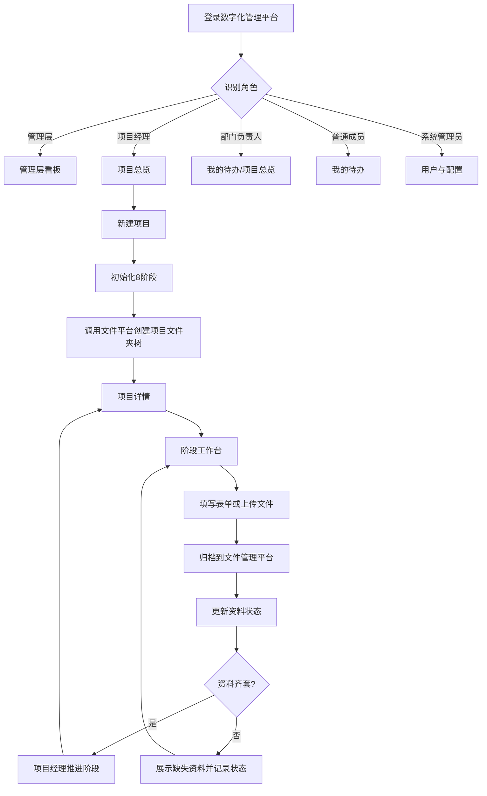
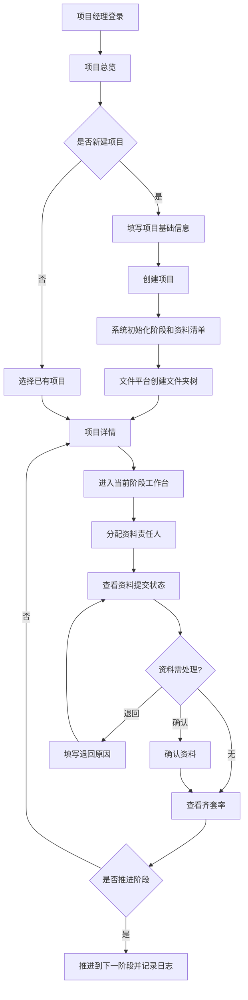
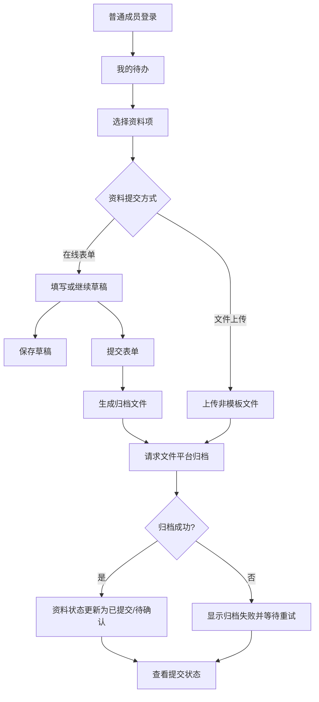
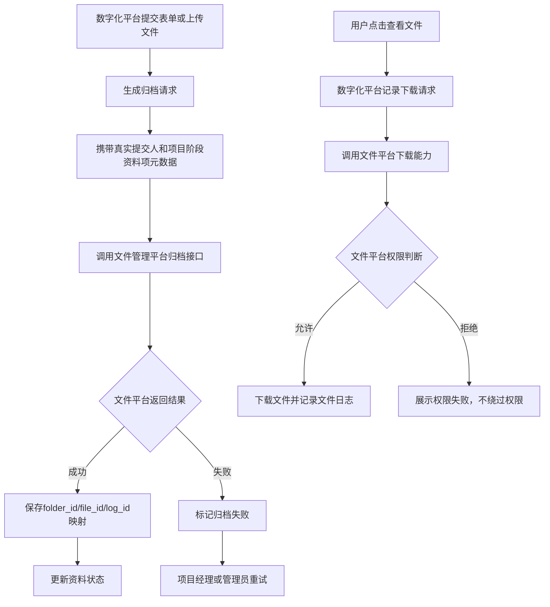
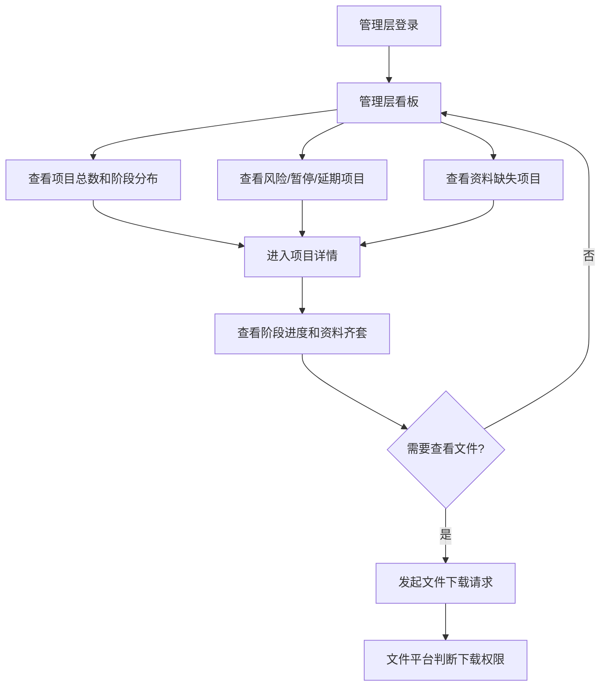

# 第一版页面清单与页面流程图

版本：v0.1  
日期：2026-05-16  
适用范围：数字化管理平台第一版页面设计

## 1. 编制依据

- `digital-demo/src/data/projectRegistry.js` 中的 `projectViews`、`stageWorkspaceConfig`
- `digital-demo/src/pages/` 中现有 Demo 页面形态
- `数字化管理平台需求沟通提纲.md`
- `数字化管理平台与文件管理平台边界及联动方案.md`
- `docs/9.1_8阶段流程与阶段定义表.md`
- `docs/9.2_阶段资料清单与责任角色表.md`
- `docs/9.5_人员角色与业务权限矩阵.md`

## 2. 第一版页面范围

第一版页面应服务于主线闭环：

```text
创建项目
  -> 自动生成或绑定项目文件夹树
  -> 进入 8 阶段流程
  -> 阶段资料清单生成
  -> 责任人填表或上传文件
  -> 文件归档到文件管理平台
  -> 数字化平台更新资料状态
  -> 项目经理推进阶段
  -> 管理层查看项目进度和资料齐套率
```

## 3. 页面清单

| 页面编号 | 页面名称 | 主要用户 | 页面目标 | 第一版主要能力 | Demo 参考 |
|---|---|---|---|---|---|
| P01 | 登录页 | 全部用户 | 用户进入数字化管理平台 | 登录、识别角色、进入对应首页 | 可新建 |
| P02 | 管理层看板 | 管理层、项目经理 | 查看项目全局状态 | 项目总数、阶段分布、重点项目、暂停项目、延期项目、资料缺失项目、临近节点项目 | `DashboardPage.vue`、`ProjectOverviewPage.vue` |
| P03 | 项目总览 | 管理层、项目经理、部门负责人 | 查看项目台账和状态 | 项目列表、筛选、阶段状态、风险/暂停/延期标识、进入项目详情 | `ProjectOverviewPage.vue` |
| P04 | 新建项目 | 项目经理 | 创建项目主数据 | 项目编号、项目名称、客户、优先级、简介、负责人、立项日期；创建后初始化阶段和目录 | `ProjectCreatePage.vue` |
| P05 | 项目详情 | 管理层、项目经理、部门负责人、普通成员按范围 | 查看单项目全过程状态 | 基础信息、8 阶段进度、当前阶段、资料齐套率、风险备注、业务日志 | `ProjectDetailPage.vue` |
| P06 | 阶段工作台 | 项目经理、部门负责人、普通成员 | 处理当前阶段资料 | 阶段目标、进入/完成条件、资料清单、责任人、状态、保存草稿、提交、上传、确认、退回、推进阶段 | `StageWorkspacePage.vue` |
| P07 | 在线表单填写页/弹窗 | 资料责任人、项目经理 | 填写标准资料 | 表单字段、保存草稿、提交、生成归档文件、展示退回原因 | `TemplateFormRenderer.vue` |
| P08 | 文件上传页/弹窗 | 资料责任人、项目经理 | 上传非模板资料 | 选择文件、上传、传递项目/阶段/资料项/提交人元数据、显示归档状态 | `DocumentsPage.vue` 可参考 |
| P09 | 资料中心/资料台账 | 项目经理、部门负责人、管理层 | 按项目和阶段查看资料状态 | 资料项列表、文件名、提交人、提交时间、归档状态、下载入口 | `DocumentsPage.vue` |
| P10 | 我的待办 | 普通成员、项目经理、部门负责人 | 查看个人要处理的资料 | 分配给我的资料、待提交、已退回、待确认、即将到期 | 可新建 |
| P11 | 业务日志 | 管理层、项目经理、系统管理员 | 追溯业务操作 | 创建项目、修改项目、分配责任人、提交、确认、退回、推进阶段、下载请求 | 可新建 |
| P12 | 用户与角色配置 | 系统管理员 | 维护数字化平台基础用户 | 用户、部门、角色、启用状态、文件平台用户 ID 映射 | 可参考文件平台后台，但不直接复用 |
| P13 | 阶段与资料模板配置 | 系统管理员 | 维护阶段、资料项、表单配置 | 8 阶段模板、资料项模板、必填标记、默认责任角色、表单字段 | 可后续二期；第一版可先静态配置 |
| P14 | 文件平台联动状态页 | 系统管理员、项目经理 | 查看目录同步和归档异常 | 文件夹树同步状态、归档失败、重试、错误原因 | 可新建 |

## 4. 角色默认首页

| 角色 | 登录后默认页面 | 说明 |
|---|---|---|
| 管理层 | 管理层看板 | 优先看全局进度、风险和资料缺失 |
| 项目经理 | 项目总览 | 进入负责项目，再进入项目详情或阶段工作台 |
| 部门负责人 | 我的待办/项目总览 | 重点看本部门待确认资料和相关项目 |
| 普通成员 | 我的待办 | 聚焦分配给自己的资料项 |
| 系统管理员 | 用户与角色配置 | 不默认进入业务流程 |

## 5. 页面结构要点

### 5.1 管理层看板

| 区块 | 展示内容 | 操作 |
|---|---|---|
| 指标区 | 项目总数、在制项目、风险项目、暂停项目、延期项目、资料缺失项目 | 点击指标筛选项目 |
| 阶段分布 | 8 阶段项目数量 | 点击阶段进入项目列表 |
| 重点项目 | P1/重点跟踪项目 | 进入项目详情 |
| 资料缺失 | 缺少必需资料项目 | 进入项目资料清单 |
| 临近节点 | 即将到期或超期项目 | 进入项目详情 |

### 5.2 项目总览

| 区块 | 展示内容 | 操作 |
|---|---|---|
| 筛选区 | 阶段、状态、优先级、客户、项目经理 | 查询、重置 |
| 项目列表 | 项目编号、项目名称、客户、阶段、状态、资料齐套率、节点日期 | 进入详情 |
| 状态标识 | 正常、风险、暂停、延期、完成 | 快速识别 |
| 新建入口 | 新建项目按钮 | 进入新建项目页 |

### 5.3 新建项目

| 字段组 | 字段 |
|---|---|
| 基础信息 | 项目编号、项目名称、客户名称、优先级、项目简介、备注说明 |
| 负责人 | 商务负责、项目经理、技术主管、项目成员 |
| 计划信息 | 立项日期、计划节点、目标完成时间 |
| 联动信息 | 文件平台部门、是否立即创建文件夹树 |

创建成功后系统动作：

1. 保存项目主数据。
2. 初始化 8 阶段记录。
3. 生成阶段资料清单。
4. 调用文件管理平台创建或绑定项目文件夹树。
5. 记录业务日志。
6. 跳转项目详情。

### 5.4 项目详情

| 区块 | 展示内容 | 操作 |
|---|---|---|
| 基础信息 | 项目编号、名称、客户、项目经理、状态、风险备注 | 编辑、标记风险、暂停/恢复 |
| 阶段主线 | 8 阶段、当前阶段、每阶段状态 | 进入阶段工作台 |
| 资料齐套 | 各阶段必需资料完成数、缺失资料 | 查看资料 |
| 文件状态 | 归档成功/失败、最新文件 | 下载或查看归档状态 |
| 业务日志 | 项目、资料、阶段推进日志 | 查看追溯 |

### 5.5 阶段工作台

| 区块 | 展示内容 | 操作 |
|---|---|---|
| 阶段说明 | 阶段目标、责任角色、进入条件、完成标志 | 无 |
| 资料清单 | 资料项、必填、责任人、状态、提交人、提交时间 | 分配责任人、打开表单、上传文件 |
| 表单/文件区 | 当前选中资料的表单或文件列表 | 保存草稿、提交、上传 |
| 确认区 | 待确认资料、退回原因 | 确认、退回 |
| 推进区 | 齐套率、缺失资料、下一阶段 | 推进阶段 |

### 5.6 我的待办

| 区块 | 展示内容 | 操作 |
|---|---|---|
| 待提交 | 分配给我的资料项 | 填表、上传 |
| 已退回 | 被退回资料和退回原因 | 修改后重新提交 |
| 待确认 | 部门负责人或项目经理需确认资料 | 确认、退回 |
| 最近提交 | 本人提交记录 | 查看状态 |

## 6. 页面流程图

### 6.1 总体业务流程



### 6.2 项目经理流程



### 6.3 普通成员流程



### 6.4 文件归档与下载流程



### 6.5 管理层查看流程



## 7. 第一版导航建议

| 导航项 | 面向角色 | 页面 |
|---|---|---|
| 看板 | 管理层、项目经理 | 管理层看板 |
| 项目 | 项目经理、部门负责人、管理层 | 项目总览、项目详情、新建项目 |
| 待办 | 普通成员、项目经理、部门负责人 | 我的待办 |
| 资料 | 项目经理、部门负责人、管理层 | 资料中心 |
| 日志 | 管理层、项目经理、系统管理员 | 业务日志 |
| 配置 | 系统管理员 | 用户与角色配置、阶段与资料模板配置 |

## 8. 开发落地提示

- `digital-demo` 可作为页面形态参考，但正式系统以 OpenSpec 和本批开发前资料为准。
- 第一版不要做营销落地页，登录后直接进入角色对应工作台。
- 普通成员页面应尽量聚焦待办，不要求其理解完整项目管理逻辑。
- 项目经理页面要保证“分配资料、看齐套率、确认/退回、推进阶段”路径足够短。
- 管理层看板指标应能点击进入项目列表或项目详情，避免只做静态展示。
- 文件下载按钮必须体现“查看即下载”的口径，并处理文件平台权限失败。
